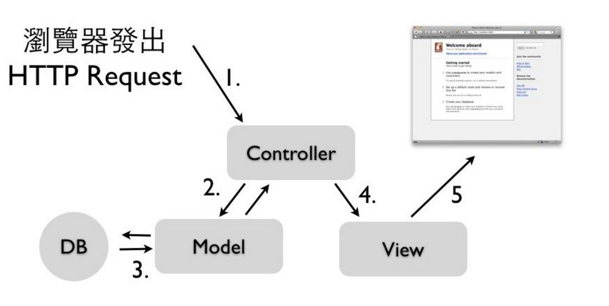

## Sublime 設定
官方文件：  
https://www.sublimetext.com/docs/2/indentation.html  
```
{
    "tab_size": 2,
    "translate_tabs_to_spaces": true
}
```

## About Rails
DHH 開發於 2005 年  
MVC 架構  
Convention over Configuration (COC)  
Don't Repeat Yourself (DRY)  
快速開發  

## MVC 架構
Model 封裝資料與商業邏輯，與資料庫裡的資料表對應  
View 使用者介面，顯示及編輯表單，可內嵌Ruby語法  
Controller 負責將資料送進送出Model，處理從外界(也就是瀏覽器)來的HTTP Request請求，與Model互動後輸出View(也就是HTML)  

## My First Rails App
```ruby
$rails new my_app_name
$bundle install
```

## What is bundler?
Gem 依存性(dependencies)管理工具  
會根據 Gemfile 的設定自動下載及安裝 Gem 套件  
在團隊開發時，維持開發者之間套件版本的一致性  

## Rails 專案裡一些重要的檔案
config/database.yml  
config/routes.rb  
Gemfile  

## database.yml
Rails 專案與 database 連結的設定檔  
development 是用於開發時的設定  
test 是用於執行自動測試時的設定  
production 是用於正式環境上的設定  

## routes.rb
設定 URL 的檔案  
設定一個 Rails 專案 API (應用程序介面)  

## Gemfile
宣告在這個 Rails 專案中使用的 gem ( Ruby 套件)  
bundler 會依據 gemfile 安裝該專案需要的套件  
每次執行 bundle 後會產生 Gemfile.lock  
Gemfile.lock 會詳細列出所有 gem 的版本  
不要修改 Gemfile.lock  

## 展示一下 Rails 的魔力
```ruby
# 使用 scaffold 指令
$rails g scaffold order name:string phone:string description:text
$rake db:migrate
```

## How Rails Work


* 瀏覽器發出HTTP request請求給Rails  
* 路由(Routing)根據規則決定派往哪一個Controller的Action  
* 負責處理的Controller Action操作Model資料  
* Model存取資料庫或資料處理  
* Controller Action將得到的資料餵給View樣板  
* 回傳最後的HTML成品給瀏覽器  

## routes.rb
```ruby
Rails.application.routes.draw do
  resources :orders

end
```

## Controller File
```ruby
class OrdersController < ApplicationController
  before_action :set_order, only: [:show, :edit, :update, :destroy]

  # GET /orders
  # GET /orders.json
  def index
    @orders = Order.all
  end

  # GET /orders/1
  # GET /orders/1.json
  def show
  end

  # GET /orders/new
  def new
    @order = Order.new
  end

  # GET /orders/1/edit
  def edit
  end

  # POST /orders
  # POST /orders.json
  def create
    @order = Order.new(order_params)

    respond_to do |format|
      if @order.save
        format.html { redirect_to @order, notice: 'Order was successfully created.' }
        format.json { render :show, status: :created, location: @order }
      else
        format.html { render :new }
        format.json { render json: @order.errors, status: :unprocessable_entity }
      end
    end
  end

  # PATCH/PUT /orders/1
  # PATCH/PUT /orders/1.json
  def update
    respond_to do |format|
      if @order.update(order_params)
        format.html { redirect_to @order, notice: 'Order was successfully updated.' }
        format.json { render :show, status: :ok, location: @order }
      else
        format.html { render :edit }
        format.json { render json: @order.errors, status: :unprocessable_entity }
      end
    end
  end

  # DELETE /orders/1
  # DELETE /orders/1.json
  def destroy
    @order.destroy
    respond_to do |format|
      format.html { redirect_to orders_url, notice: 'Order was successfully destroyed.' }
      format.json { head :no_content }
    end
  end

  private
    # Use callbacks to share common setup or constraints between actions.
    def set_order
      @order = Order.find(params[:id])
    end

    # Never trust parameters from the scary internet, only allow the white list through.
    def order_params
      params.require(:order).permit(:name, :phone, :description)
    end
end
```

## Model File
```ruby
class Order < ActiveRecord::Base
end
```

## View File
```html
<p id="notice"><%= notice %></p>

<h1>Listing Orders</h1>

<table>
  <thead>
    <tr>
      <th>Name</th>
      <th>Phone</th>
      <th>Description</th>
      <th colspan="3"></th>
    </tr>
  </thead>

  <tbody>
    <% @orders.each do |order| %>
      <tr>
        <td><%= order.name %></td>
        <td><%= order.phone %></td>
        <td><%= order.description %></td>
        <td><%= link_to 'Show', order %></td>
        <td><%= link_to 'Edit', edit_order_path(order) %></td>
        <td><%= link_to 'Destroy', order, method: :delete, data: { confirm: 'Are you sure?' } %></td>
      </tr>
    <% end %>
  </tbody>
</table>

<br>

<%= link_to 'New Order', new_order_path %>
```

## MVC 就從 M 開始

## Active Record
Ruby 的 ORM (對映射關聯式資料與物件資料)  
簡單來說，就是把資料表物件化，讓開發者不須使用 SQL 語法，直接用熟悉的 Ruby 於法操作資料  

## CRUD
任何資料結構或型別最基礎的四種操作方式：  
* CREATE - 新增資料    
* READ - 讀取資料  
* UPDATE - 編輯資料  
* DELETE - 刪除資料  


## Rails Console
類似 irb，不過只屬於一個專案的環境  
可在裡面測試 ActiveRecord  

